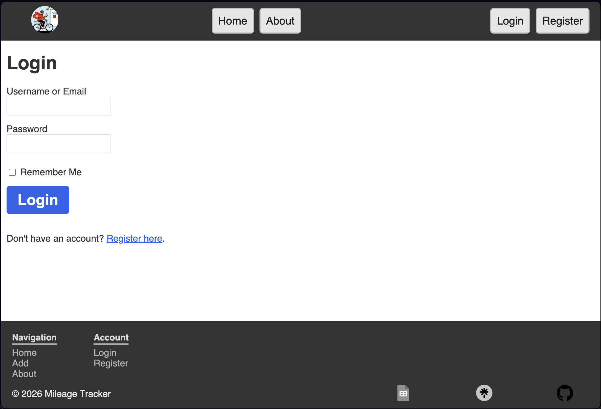
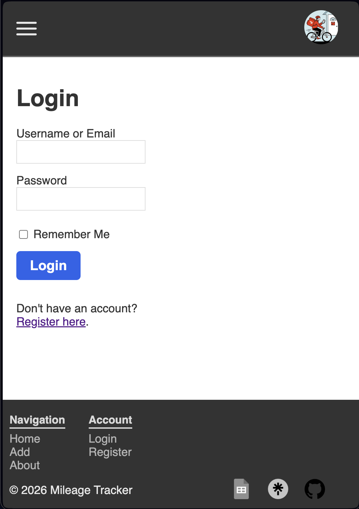
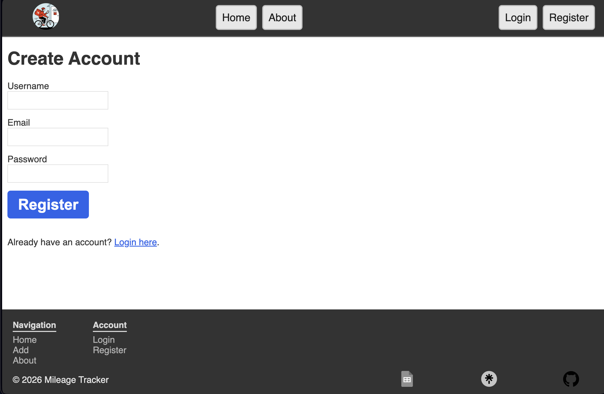
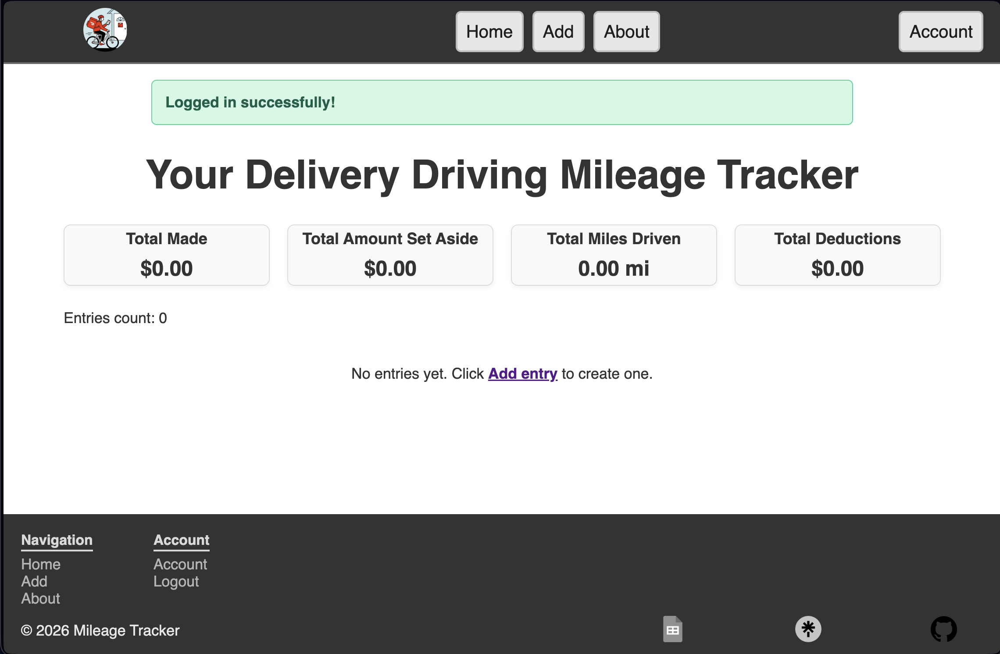
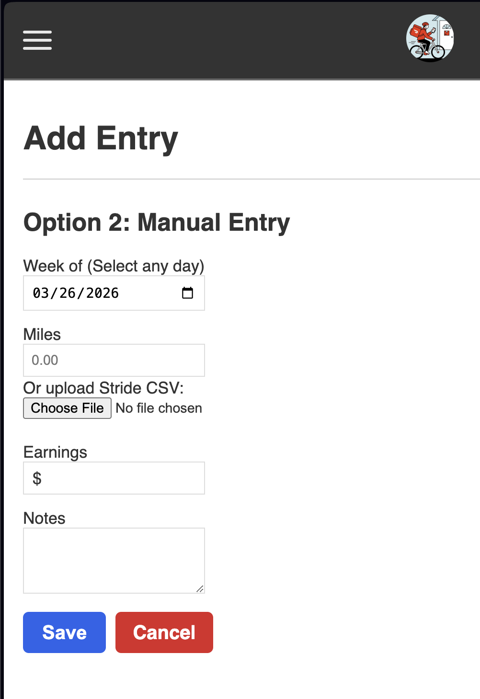
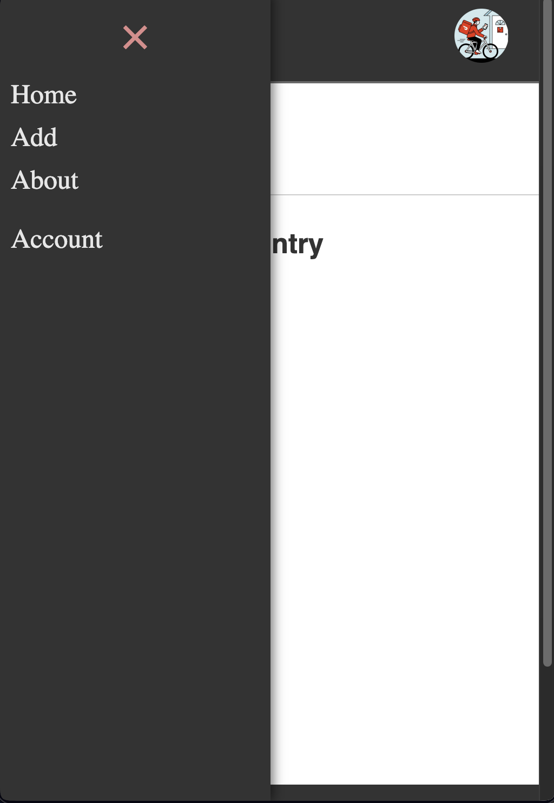
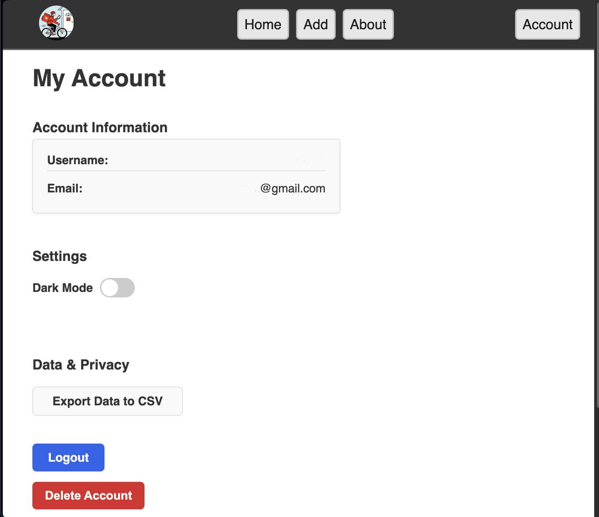
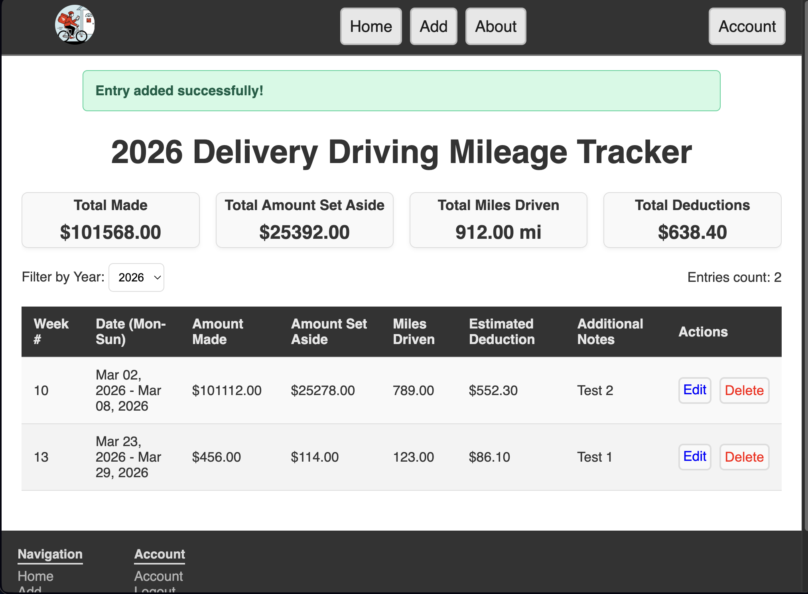

# Mileage Tracker Web App


## Overview
A full-stack web application that allows users to track mileage, calculate earnings, and manage driving-related data. Built with Flask, this app supports authentication, data persistence, and a clean user interface for managing trips.

---

## Features

### Core Features
- Add, edit, and delete mileage entries
- Track miles, earnings, and notes
- Automatic calculations (totals, deductions, set-aside)
- Export data (CSV)

### Authentication
- User registration and login
- Secure password hashing
- Session-based authentication (Flask-Login)
- CSRF protection (Flask-WTF)

### Error Handling
- Custom error pages:
  - 400 (Bad Request)
  - 404 (Page Not Found)
  - 500 (Server Error)
- Graceful handling of invalid requests and server failures

### Logging
- Server-side logging with rotating log files
- Logs stored in:
  ```text
  logs/app.log
  ```
- Tracks errors, warnings, and important events

### Testing
- Pytest-based test suite
- Covers:
  - Utility functions
  - Authentication routes
  - Entry routes
  - Error handling

---

## Tech Stack

- **Backend:** Python (Flask)
- **Frontend:** HTML, CSS, JavaScript
- **Database:** SQLite
- **Authentication:** Flask-Login
- **Forms/Security:** Flask-WTF (CSRF)
- **Testing:** Pytest
- **Deployment:** Gunicorn (with optional Nginx)

---

## Project Structure

```text
milageTrackerWebApp/
├── app.py
├── utils.py
├── models.py
├── templates/
│   ├── layouts/
│   ├── errors/
├── static/
├── tests/
│   ├── test_auth.py
│   ├── test_entries.py
│   ├── test_errors.py
│   ├── test_utils.py
├── logs/
├── mileage.db
├── requirements.txt
├── README.md
├── CHANGELOG
```

---

## Local Setup

### 1. Clone the Repository
```bash
git clone https://github.com/Kdubs6991/MilageTrackerWebApp.git
cd mileageTrackerWebApp
```

### 2. Create Virtual Environment
```bash
python -m venv .venv
source .venv/bin/activate  # macOS/Linux
.venv\\Scripts\\activate   # Windows
```

### 3. Install Dependencies
```bash
pip install -r requirements.txt
```

### 4. Set Environment Variables
Create a `.env` file:
> Do not commit your `.env` file to GitHub.

```text
SECRET_KEY=your_secret_key_here
```

### 5. Run the App
```bash
python app.py
```

Then open:
```text
http://127.0.0.1:5000
```

---

## Running Tests
> Note: Tests run against a temporary database and do not affect production data.

Run all tests:
```bash
python -m pytest tests
```

Run a specific test file:
```bash
python -m pytest tests/test_utils.py
```

---

## Deployment Notes

This app can be deployed using:
- Gunicorn (WSGI server)
- Nginx (reverse proxy)

Example:
```bash
gunicorn --workers 1 --bind 127.0.0.1:5000 app:app
```

## Requirements

- Python 3.10+
---

## Logging

Logs are written to:
```text
logs/app.log
```

View logs:
```bash
tail -f logs/app.log
```

---

## Screenshots
### Login Page


### Mobile Login


### Register Page


### Dashboard (No Entries)


### Add Entry Page


### Mobile Navigation


### Account Page


### Dashboard (With Entries)

---

## Future Improvements

- Move to PostgreSQL for scalability
- Add charts and analytics dashboard
- Improve mobile responsiveness
- Add API endpoints
- Add background jobs (e.g., scheduled backups)

---

## Author

Kaleb Wrigley